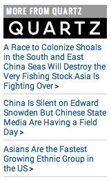

# HTML Snippet Code Library

## Contents

* TOC
{:toc}

## Typography

<table>
    <tr>
        <th width="25%">Character</th>
        <th>HTML</th>
    </tr>
    <tr>
        <td>Line break</td>
        <td>


 


        </td>
    </tr>
    <tr>
        <td>Non-breaking space</td>
        <td>


&nbsp;


        </td>
    </tr>
    <tr>
        <td>Em dash</td>
        <td>


&mdash;

        </td>
    </tr>
    <tr>
        <td>En dash</td>
        <td>


&ndash;


        </td>
    </tr>
    <tr>
        <td>Bullet</td>
        <td>


&bull;


        </td>
    </tr>
</table>

## Basics

### Horizontal rule





### Pull quote


<aside class="pullquote">
    [QUOTE]
</aside>


### Captions / Credits

#### Caption


<figure>
    
    <figcaption>CAPTION</figcaption>
</figure>


You can also float images so they don't take up the full-width by setting the size and direction
in a class.


<figure class="right one-third">
    
    <figcaption>CAPTION</figcaption>
</figure>


This will put the image on the right and make it up to one-third of the content well's width.

The direction can be `right` or `left`. The size class (which sets the width) can be `one-third` (190px on TheAtlantic.com), 
`two-thirds` (380px), `golden-ratio-big` (352px) and `golden-ratio-small` (218px).

You'll want to resize the image width to match these sizes manually.

#### Credit

Credits display slightly smaller than captions and are right-aligned


<figure>
    
    <figcaption class="credit">CREDITS</figcaption>
</figure>


#### Caption and credit

To display both a caption and a credit, use the style for captions and add the credits in parentheses after the caption text.


<figure>
    
    <figcaption>CAPTION (CREDIT)</figcaption>
</figure>


#### Caption or credit for a video

To use the caption and credit styles on videos and other embeds, use the appropriate style above and replace the `` tag with your embed code.

### Open a new window with a link (use very sparingly)


<a href="[FULL URL]" target="_blank">link text</a>


### Amazon Links

If you're linking to a book on Amazon, we'd like to let Amazon know it is coming from us. You can set up the link to the book by putting the ISBN number in this URL and using this as the link: 

    http://www.amazon.com/exec/obidos/ISBN=[10 digit ISBN number]/theatla05-20/

Example:

    http://www.amazon.com/exec/obidos/ISBN=0701206713/theatla05-20/

## Suppress Slideshow Thumbnails


<!-- START SUPPRESS SLIDESHOW THUMBNAILS -->

<!-- END SUPPRESS SLIDESHOW THUMBNAILS -->


## Creating bookmarks within a document

Put this where you want the bookmark to be:





Be sure to replace [bookmark_name] with whatever you want to call your bookmark. The name must be unique, consist only of alphanumeric characters (letters and numbers) and underscores.

Then to create a link to that bookmark, use this:


<a href="#[bookmark_name]">[link text, e.g., "go to section 1"]</a>


Be sure to replace [bookmark_name] with the bookmark’s name, and replace [link text] with whatever you like.

Here’s an example:


<!-- BOOKMARK -->

Section 1: De Dicto vel De Re

Lorem ipsum dolor amet sit . . .

Then somewhere else in the same document, I could link to that bookmark like this:

<a href="#section_1">Go to section 1</a>


The words "Go to section 1" will be a link, and when the user clicks it, the browser will jump back to the bookmark.

## Related Content

### See Also


<!-- START "SEE ALSO" v. 1 -->
<aside class="callout">
    

    <h4>See also</h4>
    <h5>(Optional subtitle)</h5>
    
<a href="[ARTICLE URL]">[ARTICLE TITLE]</a>

    

</aside>
<!-- END "SEE ALSO" v. 1 -->


 

### "More on" Box


<!-- START "MORE ON" SINGLE STORY BOX v. 2 -->
<aside class="callout">
    

    <h4>Related Story</h4>
    

        
    

    

        <a href="[URL]">[ARTICLE TITLE]</a>
    

    

</aside>
<!-- END "MORE ON" SINGLE STORY BOX v. 2 -->


 

### "More on" list box, with image


<!-- START "MORE ON" LIST BOX v. 3 -->
<!-- START "MORE ON" LIST BOX v. 3 -->
<aside class="callout">
    

    <h4>More on Coffee</h4>

<figure href="[URL]"></figure>

<ul>
    <li><a href="[URL]">Consume More Beans</a></li>
    <li><a href="[URL]">Coffee for Children and Tots</a></li>
    <li><a href="[URL]">Trading Beans for Freedom</a></li>
</ul>

</aside>
<!-- END "MORE ON" LIST BOX v. 3 -->
<!-- END "MORE ON" LIST BOX v. 3 -->


### Study of the Day


<!-- START "MORE STUDY OF THE DAY" BOX v. 1 -->
<aside class="callout">
  

  
  <ul>
    <li><a href="[ARTICLE URL]">[ARTICLE TITLE]</a></li>
    <li><a href="[ARTICLE URL]">[ARTICLE TITLE]</a></li>
    <li><a href="[ARTICLE URL]">[ARTICLE TITLE]</a></li>
  </ul>
  

</aside>
<!-- END "MORE STUDY OF THE DAY" BOX v. 1 -->


 

### More Emporium


<!-- START "MORE STUDY OF THE DAY" BOX v. 1 -->
<aside class="callout">
  

  
  <ul>
    <li><a href="[ARTICLE URL]">[ARTICLE TITLE]</a></li>
    <li><a href="[ARTICLE URL]">[ARTICLE TITLE]</a></li>
    <li><a href="[ARTICLE URL]">[ARTICLE TITLE]</a></li>
  </ul>
  

</aside>
<!-- END "MORE STUDY OF THE DAY" BOX v. 1 -->


 

### Related Video


<!-- START "RELATED VIDEO" SINGLE STORY BOX v. 1 -->
<aside class="callout">
    

    <h4>Related Video</h4>
    
    

        <a href="[ARTICLE URL]">[ARTICLE TITLE]</a>
    

    

</aside>
<!-- END "RELATED VIDEO" SINGLE STORY BOX v. 1 -->


 

### Multiple "More on" list with thumbnails


<!-- START MULTI-THUMB "MORE ON" WITH IMAGES v. 3 -->
<aside class="callout">

<h4>More on Coffee</h4>

<figure href="[URL]"></figure>

<ul>
    <li><a href="[URL]">[TITLE]</a></li>
    <li><a href="[URL]">[TITLE]</a></li>
    <li><a href="[URL]">[TITLE]</a></li>
</ul>

</aside>
<!-- END MULTI-THUMB "MORE ON" WITH IMAGES v. 3 -->


### Notes 

<!-- Read "Follow-up Notes" -->
<aside class="callout callout-notes">

<h4>Read Follow-Up <a href="http://www.theatlantic.com/notes/">Notes</a></h4>
<ul>
    <li><a href="[NOTE URL]">[NOTE TITLE]</a></li>
    <li><a href="[NOTE URL]">[NOTE TITLE]</a></li>
</ul>

</aside>
</aside>
<!-- END "Follow-up Notes" -->


## More From Partners

These are thin bars that go on the right size of NJ/Quartz stories.

### More from Quartz

<!-- START "MORE FROM" QZ -->
<aside class="partner-box">
    

    <h4 class="qz">More From <a href="http://qz.com">Quartz</a></h4>
        <ul>
            <li><a href="[ARTICLE URL]">[ARTICLE TITLE]</a></li>
            <li><a href="[ARTICLE URL]">[ARTICLE TITLE]</a></li>
            <li><a href="[ARTICLE URL]">[ARTICLE TITLE]</a></li>
        </ul>
    

    </aside>
<!-- END "MORE FROM" QZ -->


### More from GovExec

<!-- START "MORE FROM" GOVEXEC -->
<aside class="partner-box">
    

    <h4 class="govexec">More From <a href="http://govexec.com">GovExec</a></h4>
        <ul>
            <li><a href="[ARTICLE URL]">[ARTICLE TITLE]</a></li>
            <li><a href="[ARTICLE URL]">[ARTICLE TITLE]</a></li>
            <li><a href="[ARTICLE URL]">[ARTICLE TITLE]</a></li>
        </ul>
    

</aside>
<!-- END "MORE FROM" GOVEXEC -->


### More From National Journal

<!-- START "MORE FROM" NATIONAL JOURNAL -->
<aside class="partner-box">
    

    <h4 class="nj">More From <a href="http://nationaljournal.com">National Journal</a></h4>
    <ul>
        <li>
            <a href="[ARTICLE URL]">[ARTICLE TITLE]</a>
        </li>
        <li>
            <a href="[ARTICLE URL]">[ARTICLE TITLE]</a>
        </li>
        <li>
            <a href="[ARTICLE URL]">[ARTICLE TITLE]</a>
        </li>
    </ul>
    

</aside>
<!-- END "MORE FROM" NATIONAL JOURNAL -->


### More from Defense One


<!-- START "MORE FROM" DEFENSE ONE -->
<aside class="partner-box">
    

    <h4 class="defense-one">More From <a href="http://defenseone.com">Defense One</a></h4>
    <ul>
        <li><a href="[ARTICLE URL]">[ARTICLE TITLE]</a></li>
        <li><a href="[ARTICLE URL]">[ARTICLE TITLE]</a></li>
        <li><a href="[ARTICLE URL]">[ARTICLE TITLE]</a></li>
    </ul>
    

    </aside>
<!-- END "MORE FROM" QZ -->


### More from Anyone Else (Custom)

Copy the code below, edit the link and couple click the
empty image to upload the logo into cropduster.


<!-- START "MORE FROM" Custom -->
<aside class="partner-box custom">

<h4>More From</h4>

<figure></figure>

<ul>
    <li><a href="[ARTICLE URL]">[ARTICLE TITLE]</a></li>
    <li><a href="[ARTICLE URL]">[ARTICLE TITLE]</a></li>
    <li><a href="[ARTICLE URL]">[ARTICLE TITLE]</a></li>
</ul>

</aside>
<!-- END "MORE FROM" Custom -->


## Video

### From the CMS

You can find this code with the embed button on video channel pages.


<iframe width="640" height="360" frameborder="0" webkitallowfullscreen="webkitallowfullscreen" 
    allowfullscreen="allowfullscreen" mozallowfullscreen="mozallowfullscreen" 
    src="http://www.theatlantic.com/video/iframe/[VIDEOARTICLE_ID]/"></iframe>


### From Brightcove

Videos that don't live in Waldo/Ollie can be included if you have their Brightcove ID.


<iframe width="640" height="360" frameborder="0" webkitallowfullscreen="webkitallowfullscreen" 
    allowfullscreen="allowfullscreen" mozallowfullscreen="mozallowfullscreen" 
    src="http://www.theatlantic.com/video/embed/?brightcove_id=[BRIGHTCOVE_ID]"></iframe>


**Optional:** You can add `&player=[playername]` to the end of the `src` to control which kind of player is served. This is mainly to separate 
advertising and analytics - you usually don't need it. The players are:

* `events` (for Atlantic Live)
* `features` (legacy)
* `cities` (for videos in the Cities account)
* `national-journal` (for NJ's videos that aren't imported into our system)


<iframe width="640" height="360" frameborder="0" webkitallowfullscreen="webkitallowfullscreen" 
    allowfullscreen="allowfullscreen" mozallowfullscreen="mozallowfullscreen" 
    src="http://www.theatlantic.com/video/embed/?brightcove_id=[BRIGHTCOVE_ID]&player=[PLAYER]"></iframe>


### Full Width Video

Like images, wrap them in a `full-width` figure.


<figure class="full-width">
    <iframe width="640" height="360" frameborder="0" webkitallowfullscreen="webkitallowfullscreen" 
        allowfullscreen="allowfullscreen" mozallowfullscreen="mozallowfullscreen" 
        src="..."></iframe>
</figure>

